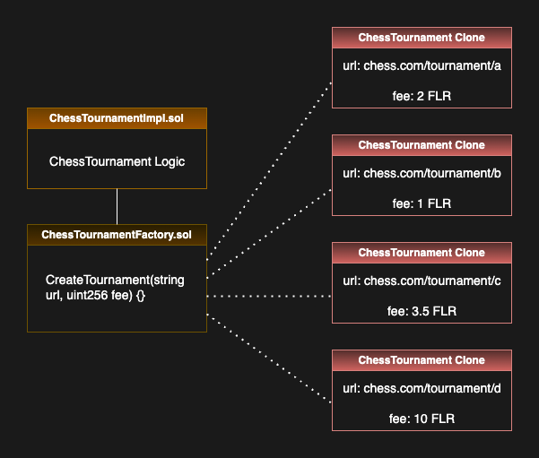
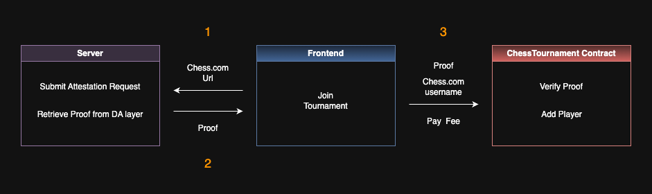
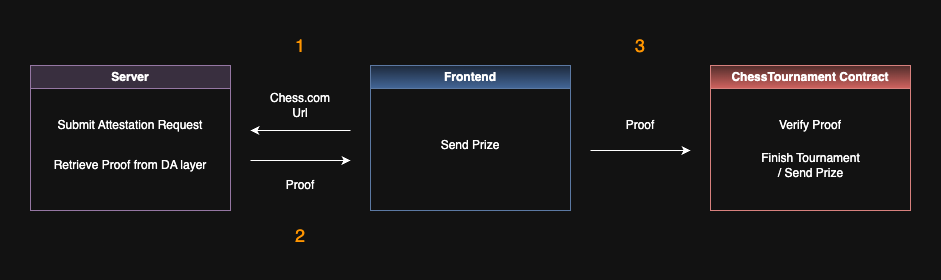

# CryptoChess
CryptoChess is a dApp on the Flare network that allows players to compete for crypto prizes by linking smart contracts to tournaments on chess.com. It leverages the Flare Data Connector (FDC) to verify data from the chess.com API, such as the players participating in the tournament, the tournament status and the winner of the tournament.

## Flow
1. The tournament organizer creates a tournament on chess.com and invites players to join.

2. From the CryptoChess frontend the tournament organizer deploys a smart contract with the chess.com url of the tournament and a chosen participation fee as arguments. The frontend calls the createTournament function on the ChessTournament factory contract which deploys a clone of the ChessTournament implementation contract, with the arguments provided by the tournament organizer. See the diagram below:

3. Players select the tournament from the list on the frontend and join by submitting their chess.com username and paying the participation fee. This will send a request to the backend server to submit an attestation request and retrieve a proof from the DA layer to verify that the username submitted is indeed part of the tournament on chess.com. This proof is sent back to the frontend and provided as argument to the addPlayer function on the tournament contract, which upon verification will receive the payment and map the player's username to their wallet address.

4. When all players have paid the participation fee, the players play the tournament on chess.com.

5. After the tournament is finished, anyone can trigger the "Send Prize" button on the frontend, which sends a request to the backend to submit an attestation request and retrieve a proof from the DA layer to verify the tournament status and winner. This proof is sent back to the frontend and provided as argument for the finishTournament function on the tournament contract. If the proof is valid, the prize money in the contract (the total amount of participation fees paid by the players) is sent to the address mapped to the winner's username.

