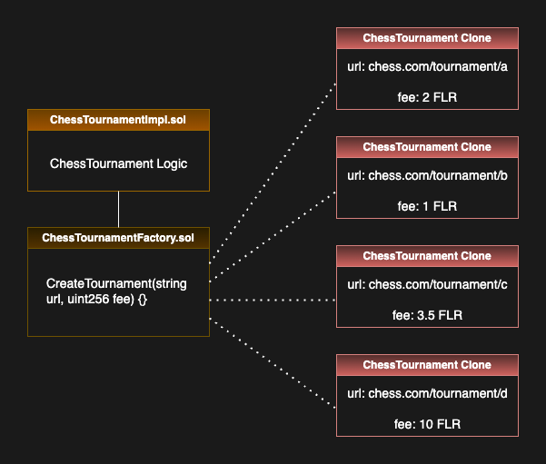

# CryptoChess
CryptoChess is a dApp on the Flare network that allows users to link smart contracts to tournaments on the chess.com website. It leverages Flare JsonApi attestations to prove tournament data gathered from the chess.api, such as the players and the winner.

## Flow
1. Tournament organizer creates a tournament on chess.com and invites players to join.
2. Tournament organizer creates a ChessTournament smart contract by calling the contract ChessTournamentFactory with the chess.com tournament link and entry fee as parameters.
3. Players select the tournament from the list and join by submitting their chess.com username and paying the entry fee. The backend will make an attestation request and verify that the username submitted is indeed part of the tournament on chess.com.
4. The players play the tournament on chess.com.
5. After the tournament is finished, call the finishTournament function on the tournament page. The backend will make an attestation request and verify that the tournament is finished, and who the winner is. The winner will be sent the amount of tokens inside the contract (the total of the entry fees paid by the players).

Contract structure:

